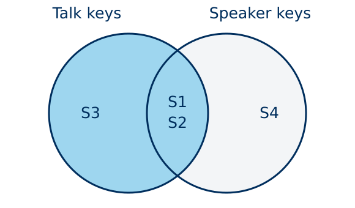
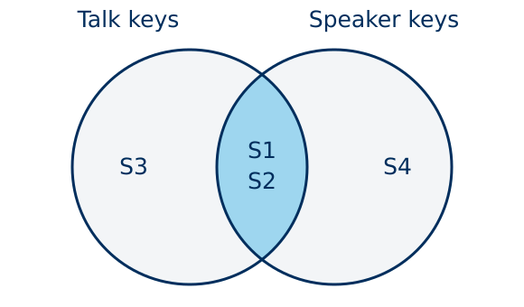
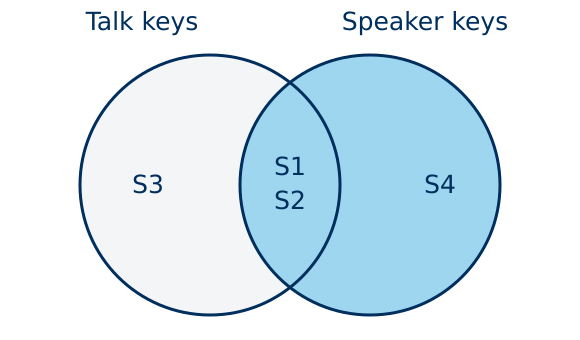
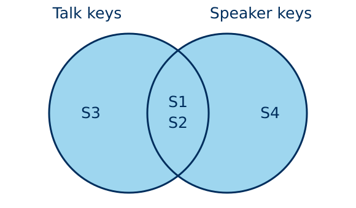

## Review: row identity

| talk_id | keyword | count |
|---|---|---|
| T1 | faith | 4 |
| T1 | prayer | 2 |
| T2 | faith | 1 |
| T2 | prayer | 3 |

With a partner: What does one row represent? Which columns identify it?

What would go wrong if we pivoted using talk_id alone?

::: notes
Give 45 seconds. Retrieve the prior lesson rather than reteach it. The row unit is a talk-keyword combination. talk_id alone repeats. Ask them to name the pair before revealing the answer.
:::

## Review: the identifying columns

One row represents one talk-keyword combination.

The key is (talk_id, keyword). Each pair appears once.

```python
wide = long.pivot(
    index="talk_id", columns="keyword", values="count"
)
```

| talk_id | faith | prayer |
|---|---|---|
| T1 | 4 | 2 |
| T2 | 1 | 3 |

::: notes
The pivot uses the identifying pair to locate a value. Today a join uses keys to locate related records in another table. Do not spend time rerunning pivot.
:::

## A question that needs another table

How does average talk length differ between speaker groups?

:::: {.columns}

::: {.column width="50%"}

**talks: one row per talk**

| talk_id | speaker_id | num_words |
|---|---|---|
| T1 | S1 | 1000 |
| T2 | S1 | 1200 |
| T3 | S1 | 1400 |
| T4 | S2 | 2400 |
| T5 | S3 | 1600 |

:::

::: {.column width="50%"}

**speakers: one row per speaker**

| speaker_id | speaker | group |
|---|---|---|
| S1 | Avery | A |
| S2 | Blair | B |
| S4 | Casey | B |

:::

::::

All names, groups, and values are fictional teaching data.

::: notes
Ask which table contains the measurements and which contains the grouping variable. The speaker table includes S4 without a talk. Talks include S3 without a speaker record. Do not reveal those consequences yet.
:::

## One master file repeats speaker information

A single CSV is convenient when someone has already prepared it for analysis.

| talk_id | speaker_id | num_words | speaker | group |
|---|---|---|---|---|
| T1 | S1 | 1000 | Avery | A |
| T2 | S1 | 1200 | Avery | A |
| T3 | S1 | 1400 | Avery | A |
| T4 | S2 | 2400 | Blair | B |

Avery’s details repeat in three rows. A correction would require updating each copy.

If only one copy changes, the same speaker can have conflicting information.

::: notes
Ask how many copies of Avery’s details appear. A prepared CSV is a useful analysis product. Repeated authoritative records create maintenance problems. All values are fictional.
:::

## Separate tables support reliable updates

A speaker table stores a speaker’s details once. Each talk references the speaker ID.

A new speaker can enter the directory before giving a talk. A new talk can reference an existing speaker.

Many talks can share the same speaker, conference, and session records.

A join creates the combined table we need for analysis. We can export that result as a CSV.

::: notes
Distinguish maintaining data from preparing an analysis table. Separate tables reduce redundancy, allow independent additions, and support integrity constraints in databases. Avoid normalization jargon. Changing historical characteristics may need dated records.
:::

## Keys

| Term | Meaning | Example |
|---|---|---|
| Primary key | Uniquely identifies a row in its table | talk_id in talks |
| Foreign key | References a key in another table | speaker_id in talks |
| Composite key | Uses several columns together | year + season |

speaker_id repeats in talks and is unique in our clean speakers table.

CSV files do not enforce these relationships. We check them.

::: notes
A primary key must be unique and nonmissing. Foreign-key references should have a parent record in well-formed relational data, but imported files may violate that expectation. The unmatched S3 is a coverage problem to investigate. Year plus season identifies our fictional conferences, not an individual session.
:::

## Cardinality depends on the join key

| Relationship | Key uniqueness | Example |
|---|---|---|
| One-to-one | Unique on both sides | Talks + one transcript per talk |
| Many-to-one | Repeats left, unique right | Talks + speakers |
| One-to-many | Unique left, repeats right | Speakers + talks |
| Many-to-many | Repeats on both sides | Talks + multiple speaker records |

For talks on the left and speakers on the right, we expect many-to-one.

Predict whether the intended row unit will survive the join.

::: notes
Always state the left and right direction. One-to-many may be perfectly legitimate when we want one speaker-talk row. Many-to-many can also be legitimate, but all matching pairs affect the row meaning. Explain it further after the pair-multiplication example.
:::

## Join types as overlapping sets of keys

<div class="venn-grid"><div class="venn-item"><h3>Left join</h3><p>All talk keys: S1, S2, S3</p></div><div class="venn-item"><h3>Inner join</h3><p>Shared keys: S1, S2</p></div><div class="venn-item"><h3>Right join</h3><p>All speaker keys: S1, S2, S4</p></div><div class="venn-item"><h3>Outer join</h3><p>Either table: S1, S2, S3, S4</p></div></div>

Blue regions show retained keys. Repeated keys can create multiple matching rows.

::: notes
Show before join code. Circles are distinct speaker IDs in each table. S1/S2 overlap, S3 is only in talks, S4 only in speakers. Ask which region retains every talk key. The diagrams explain retention. Matching pairs explain output row counts later.
:::

## Prediction: a left join

:::: {.columns}

::: {.column width="50%"}

**Left: talks**

| talk_id | speaker_id | num_words |
|---|---|---|
| T1 | S1 | 1000 |
| T2 | S1 | 1200 |
| T3 | S1 | 1400 |
| T4 | S2 | 2400 |
| T5 | S3 | 1600 |

:::

::: {.column width="50%"}

**Right: speakers**

| speaker_id | speaker | group |
|---|---|---|
| S1 | Avery | A |
| S2 | Blair | B |
| S4 | Casey | B |

:::

::::

We will match speaker_id and retain every talk.

How many rows? Which talk lacks speaker information? Does S4 appear?

::: notes
Give 45 seconds before revealing. Expected five rows because the right key is unique. T5 lacks metadata. S4 does not appear. Repeated left keys are expected and do not alone increase the row count.
:::

## Left join: every talk remains

```python
left = pd.merge(
    talks, speakers, on="speaker_id", how="left"
)
left
```

| talk_id | speaker_id | num_words | speaker | group |
|---|---|---|---|---|
| T1 | S1 | 1000 | Avery | A |
| T2 | S1 | 1200 | Avery | A |
| T3 | S1 | 1400 | Avery | A |
| T4 | S2 | 2400 | Blair | B |
| T5 | S3 | 1600 | NA | NA |

5 talks remain. T5 has no matching speaker record.

::: notes
Talks is the left argument. how controls retention, on supplies equality keys. Matching uses key values regardless of row position. NA is our display label for a pandas missing value. A left join retains every left row, but can repeat it if several right records match. Reference: https://pandas.pydata.org/docs/reference/api/pandas.merge.html
:::

## Prediction: an inner join

:::: {.columns}

::: {.column width="50%"}

**talks**

| talk_id | speaker_id | num_words |
|---|---|---|
| T1 | S1 | 1000 |
| T2 | S1 | 1200 |
| T3 | S1 | 1400 |
| T4 | S2 | 2400 |
| T5 | S3 | 1600 |

:::

::: {.column width="50%"}

**speakers**

| speaker_id | speaker | group |
|---|---|---|
| S1 | Avery | A |
| S2 | Blair | B |
| S4 | Casey | B |

:::

::::

We now retain only matching pairs.

Which talk disappears? How many rows remain? What population does the result describe?

::: notes
Give 30 seconds. Students should identify T5 and predict four rows. Connect the retained population to known speaker metadata.
:::

## Inner join: matched talks only

```python
inner = pd.merge(
    talks, speakers, on="speaker_id", how="inner"
)
inner
```

| talk_id | speaker_id | num_words | speaker | group |
|---|---|---|---|---|
| T1 | S1 | 1000 | Avery | A |
| T2 | S1 | 1200 | Avery | A |
| T3 | S1 | 1400 | Avery | A |
| T4 | S2 | 2400 | Blair | B |

4 rows remain. T5 disappears because S3 has no speaker record.

::: notes
An inner join changes coverage. Losing a record can be intentional, but must match the analysis question. Default merge how is inner, so specify how explicitly. Reference: https://pandas.pydata.org/docs/reference/api/pandas.merge.html
:::

## The _merge column records where keys match

```python
audited = pd.merge(
    talks, speakers, on="speaker_id", how="left",
    indicator=True,
)
audited[["talk_id", "speaker_id", "group", "_merge"]]
```

| talk_id | speaker_id | group | _merge |
|---|---|---|---|
| T1 | S1 | A | both |
| T2 | S1 | A | both |
| T3 | S1 | A | both |
| T4 | S2 | B | both |
| T5 | S3 | NA | left_only |

indicator=True adds _merge. Its values describe the source of each match.

::: notes
_merge is a new categorical column, not an index or command. The projection shows every row. Reference: https://pandas.pydata.org/docs/reference/api/pandas.merge.html
:::

## The three matching labels

| Value in _merge | Meaning |
|---|---|
| both | The key matched a row in each input table |
| left_only | The retained left row has no right-table match |
| right_only | The retained right row has no left-table match |

Our left join contains both and left_only rows. It cannot contain right_only rows.

An outer or right join would retain S4 as right_only.

A row labeled both can still have missing metadata in another column.

::: notes
Differentiate category definitions from actual values. value_counts may show right_only with zero because the category exists. The labels describe key matching, not completeness of every metadata field. Reference: https://pandas.pydata.org/docs/reference/api/pandas.merge.html
:::

## Equality produces a mask, then loc keeps rows

```python
mask = audited["_merge"].eq("left_only")
unmatched = audited.loc[mask]
unmatched[["talk_id", "speaker_id", "_merge"]]
```

:::: {.columns}

::: {.column width="50%"}

| talk_id | _merge | mask |
|---|---|---|
| T1 | both | False |
| T2 | both | False |
| T3 | both | False |
| T4 | both | False |
| T5 | left_only | True |

:::

::: {.column width="50%"}

::: {.compact-table}

**unmatched**

| talk_id | speaker_id | _merge |
|---|---|---|
| T5 | S3 | left_only |

:::

:::

::::

.eq("left_only") compares each value with the string "left_only". It is equivalent to == "left_only".

.loc[mask] keeps the rows whose mask is True. Here, only T5 remains.

::: notes
Read three stages: select a column, compare element by element, use the Boolean Series to filter. Predict the five mask values before running. Show the full mask and filtered row. Reference: https://pandas.pydata.org/docs/reference/api/pandas.Series.eq.html
:::

## A summary after joining

```python
summary = (
    left.groupby("group", dropna=False, as_index=False)
    .agg(n_talks=("talk_id", "size"),
         mean_words=("num_words", "mean"))
)
```

| group | n_talks | mean_words |
|---|---|---|
| A | 3 | 1200 |
| B | 1 | 2400 |
| NA | 1 | 1600 |

dropna=False retains the talk whose group is unknown.

These means weight talks equally. They do not weight speakers equally.

::: notes
Default groupby excludes missing grouping values. Keep the unknown group visible rather than silently excluding T5. Ask why group A has three talks but one speaker. Summaries of talks and summaries of speakers answer different questions.
:::

## Prediction: a duplicated speaker key

:::: {.columns}

::: {.column width="50%"}

**Three talks for S1**

| talk_id | speaker_id | num_words |
|---|---|---|
| T1 | S1 | 1000 |
| T2 | S1 | 1200 |
| T3 | S1 | 1400 |

:::

::: {.column width="50%"}

**Two speaker records for S1**

| speaker_id | speaker | group |
|---|---|---|
| S1 | Avery | A |
| S1 | Avery | B |

:::

::::

We match speaker_id again. How many rows will S1 contribute?

How many rows will the full left join contain?

::: notes
Give 45 seconds. S1 contributes six pairs. Full join has eight rows: six for S1, one for S2, one unmatched S3. Both right rows match even though group differs.
:::

## Each matching pair produces a row

```python
bad = pd.merge(talks, speakers_conflicting,
               on="speaker_id", how="left")
bad[["talk_id", "speaker_id", "num_words", "group"]]
```

::: {.compact-table}

| talk_id | speaker_id | num_words | group |
|---|---|---|---|
| T1 | S1 | 1000 | A |
| T1 | S1 | 1000 | B |
| T2 | S1 | 1200 | A |
| T2 | S1 | 1200 | B |
| T3 | S1 | 1400 | A |
| T3 | S1 | 1400 | B |
| T4 | S2 | 2400 | B |
| T5 | S3 | 1600 | NA |

:::

S1 contributes 3 × 2 = 6 pairs. The complete left join contains 8 rows.

::: notes
Read T1 twice, then T2 twice. The output unit is now a talk-speaker-record pair. The database has no basis for picking A over B. A left join promises retention, not unchanged row count. Reference: https://pandas.pydata.org/docs/reference/api/pandas.merge.html
:::

## Join size from key frequencies

For a key with m left rows and n right rows, an inner join produces m × n rows.

| Left frequency m | Right frequency n | Matching pairs |
|---|---|---|
| 3 | 1 | 3 |
| 3 | 2 | 6 |
| 3 | 0 | 0 |

A left join contributes m × max(n, 1) rows for that key.

The unmatched S3 talk contributes one row to the left join.

::: notes
Sum contributions across left keys for total left-join size. Formulas apply to these equality joins with complete keys. Appendix notes that pandas can match missing keys. The frequency rule explains the result rather than treating duplication as random behavior. Reference: https://pandas.pydata.org/docs/reference/api/pandas.merge.html
:::

## Pair activity: enriching talks

Open student_activity.py in this repo and run its setup cell.

Goal: retain every talk and compare mean word count by speaker group.

1. Predict the relationship and the left-join row count.
2. Join the clean speaker table to talks.
3. Identify unmatched talks.
4. Summarize talk counts and mean word counts by group.

Use the first 7 minutes. Keep the unknown group visible.

::: notes
Start a 15-minute activity here. Students open the starter in the shared repo. Ask them to attempt the activity before opening the solutions. Encourage a quick written prediction before code. Hint for unknown groups is dropna=False. Pairs can inspect objects in Positron.
:::

## Pair activity: an unexpected result

Run the supplied join with speakers_conflicting.

5. Explain the new row count using key frequencies.
6. Identify the talks that appear more than once.
7. Inspect the conflicting speaker records.
8. Propose a repair using the documented record_status rule.

Use the remaining 8 minutes. Prepare to explain why the repair is justified.

::: notes
For this fictional exercise record_status=current means the authoritative record for our analysis and retired means superseded. Students should inspect before filtering. If students need help, point them to duplicated("speaker_id", keep=False). Do not suggest blind drop_duplicates on speaker_id.
:::

## Activity debrief: the clean join

| Check | Result |
|---|---|
| Input talks | 12 |
| Joined rows | 12 |
| Matched talks | 11 |
| Unmatched talk | A12, speaker S9 |

| group | n_talks | mean_words |
|---|---|---|
| A | 6 | 1500 |
| B | 5 | 1960 |
| NA | 1 | 2100 |

The group counts sum to all 12 talks.

::: notes
A has six talks with mean 1500.0, B five with mean 1960.0, unknown one with mean 2100.0. Speaker S5 has no talks and never enters this left join. Ask how an inner join would change coverage: eleven rows.
:::

## Activity debrief: the extra rows

| speaker_id | speaker | group | record_status |
|---|---|---|---|
| S1 | Avery | A | current |
| S1 | Avery | B | retired |

S1 has 4 talks and 2 matching records, producing 8 rows.

The join contains 16 rows. A01, A02, A03, and A04 each appear twice.

The output mixes current and retired classifications for the same speaker.

::: notes
Row count is 8 for S1 plus 8 for every other talk. Duplicate rows are matching pairs, not an implementation error. record_status exists on the lookup table and must inform selection before joining.
:::

## Validation enforces the expected relationship

```python
pd.merge(
    activity_talks, speakers_conflicting,
    on="speaker_id", how="left",
    validate="many_to_one",
)
```

MergeError: Merge keys are not unique in right dataset; not a many-to-one merge

many_to_one checks the right key. It permits repeated speaker IDs in talks.

Validation checks key uniqueness. It does not guarantee that every talk matches.

::: notes
Here talks and speakers_conflicting refer to the activity objects. Error wording is simplified for readability. One_to_one checks both sides, one_to_many checks the left, many_to_one checks the right. many_to_many permits repetition and performs no uniqueness check. Reference: https://pandas.pydata.org/docs/reference/api/pandas.merge.html
:::

## A repair based on the data meaning

:::: {.columns}

::: {.column width="50%"}

```python
current = speakers_conflicting.loc[
    speakers_conflicting["record_status"]
    .eq("current")
]
fixed = pd.merge(
    activity_talks, current,
    on="speaker_id", how="left",
    validate="many_to_one",
    indicator=True,
)
fixed[["talk_id", "group", "_merge"]]
```

:::

::: {.column width="50%"}

::: {.compact-table}

| talk_id | group | _merge |
|---|---|---|
| A01 | A | both |
| A02 | A | both |
| A03 | A | both |
| A04 | A | both |
| A05 | B | both |
| A06 | B | both |
| A07 | B | both |
| A08 | A | both |
| A09 | A | both |
| A10 | B | both |
| A11 | B | both |
| A12 | NA | left_only |

:::

:::

::::

The status rule restores 12 rows. A12 still lacks a speaker record.

::: notes
This repair applies only because the exercise defines current as authoritative for this analysis. In real longitudinal data, an old record may be the right one for an earlier talk. A date-aware matching rule could then be necessary. Never claim keeping first or latest is universally correct.
:::

## Row multiplication changes the analysis

Return to the five-talk demonstration.

| Quantity | Original talks | Join with conflicting speakers |
|---|---|---|
| Rows | 5 | 8 |
| Total word count | 7,600 | 11,200 |
| Mean word count | 1,520 | 1,400 |

Duplicating S1 gives its shorter talks more weight.

A successful merge can still produce a misleading summary.

::: notes
Calculate across all rows here, including unmatched T5. The three S1 talks sum to 3600, which the flawed join counts twice. Group classification also changes because the added row has group B. Ask how the table would affect a claim about mean length.
:::

## Prediction: a composite key

:::: {.columns}

::: {.column width="50%"}

**Talks (first three)**

| talk_id | year | season |
|---|---|---|
| A01 | 2025 | April |
| A02 | 2025 | April |
| A03 | 2025 | October |

:::

::: {.column width="50%"}

**conference_metadata**

| year | season | location |
|---|---|---|
| 2025 | April | North Hall |
| 2025 | October | South Hall |
| 2026 | April | East Hall |
| 2026 | October | West Hall |

:::

::::

We want one conference location attached to each talk.

What happens if we join using year alone? Which columns identify a conference?

::: notes
Give 30 seconds. Year repeats twice in the metadata table. Joining year alone creates two matches per talk, doubles the full activity table to 24 rows, and assigns two possible locations.
:::

## Composite key: year and season

:::: {.columns}

::: {.column width="50%"}

```python
with_location = pd.merge(
    activity_talks, conference_metadata,
    on=["year", "season"],
    how="left",
    validate="many_to_one",
)
with_location[[
    "talk_id", "year",
    "season", "location"
]]
```

:::

::: {.column width="50%"}

::: {.compact-table}

| talk_id | year | season | location |
|---|---|---|---|
| A01 | 2025 | April | North Hall |
| A02 | 2025 | April | North Hall |
| A03 | 2025 | October | South Hall |
| A04 | 2025 | October | South Hall |
| A05 | 2025 | April | North Hall |
| A06 | 2025 | October | South Hall |
| A07 | 2026 | April | East Hall |
| A08 | 2026 | April | East Hall |
| A09 | 2026 | October | West Hall |
| A10 | 2026 | April | East Hall |
| A11 | 2026 | October | West Hall |
| A12 | 2026 | October | West Hall |

:::

:::

::::

All 12 talks have one location. Joining on year alone would yield 24 rows.

::: notes
All twelve output rows appear for the selected columns. year and season identify a conference, not a session. activity_talks avoids overwriting the five-row example. Reference: https://pandas.pydata.org/docs/reference/api/pandas.merge.html
:::

## A checking routine for joins

Before joining: describe the intended row unit and expected relationship.

:::: {.columns}

::: {.column width="50%"}

```python
talks["talk_id"].is_unique
speakers["speaker_id"].is_unique
speakers["speaker_id"].isna().sum()
```

:::

::: {.column width="50%"}

| Check | Output |
|---|---|
| Unique talk IDs | True |
| Unique speaker IDs | True |
| Missing speaker keys | 0 |

:::

::::

During joining: specify keys, retention, and validate.

After joining: check row counts, row identity, and unmatched records.

::: notes
The routine is conceptual, not a claim that these three expressions check all data. Composite key uniqueness uses duplicated(["year", "season"]). Check key types and formatting when valid-looking records do not match. Missing keys require explicit attention because pandas may match them.
:::

## Exit check

You have one row per enrollment with course_id.

The course catalog should have one row per course_id.

1. How do you retain every enrollment and attach the course title?
2. Which validation rule fits?
3. What could make the joined table longer?
4. How would you find enrollments without catalog matches?

Next time: What do missing values tell us about how the data were collected?

::: notes
Give about one minute for a written response. The course catalog analogy checks transfer beyond the conference example. Reveal the next slide after responses. Bridge from joining-generated missingness to missingness theory without claiming that all missing values have the same mechanism.
:::

## Exit check: one working answer

```python
enriched = pd.merge(
    enrollments, catalog, on="course_id", how="left",
    validate="many_to_one", indicator=True,
)
unmatched = enriched.loc[
    enriched["_merge"].eq("left_only")
]
```

Duplicate matching course IDs in the catalog can repeat an enrollment.

The intended result keeps one row per enrollment.

::: notes
Answer slide. The code is a transfer example, not an executed conference-data cell. many_to_one will reject a nonunique right key before producing the duplicated result. Student uniqueness may require student_id plus course_id plus term or a dedicated enrollment_id. Reference: https://pandas.pydata.org/docs/reference/api/pandas.merge.html
:::

## Reference: names and overlapping columns

:::: {.columns}

::: {.column width="50%"}

```python
directory = speakers.rename(
    columns={"speaker_id": "person_id"}
)
renamed = pd.merge(
    talks, directory,
    left_on="speaker_id",
    right_on="person_id",
    how="left",
    validate="many_to_one",
)
renamed[["talk_id", "person_id", "speaker"]]
```

:::

::: {.column width="50%"}

| talk_id | person_id | speaker |
|---|---|---|
| T1 | S1 | Avery |
| T2 | S1 | Avery |
| T3 | S1 | Avery |
| T4 | S2 | Blair |
| T5 | NA | NA |

:::

::::

left_on and right_on name each key. suffixes labels overlapping non-key columns.

::: notes
Optional reference after the main lecture. The runnable demo illustrates different key names. Overlapping fields need interpretation before deciding which to keep. No live walkthrough unless a question requires it. Reference: https://pandas.pydata.org/docs/reference/api/pandas.merge.html
:::

## Reference: missing keys

```python
left_keys = pd.DataFrame({"key": [None], "x": [1]})
right_keys = pd.DataFrame({"key": [None], "y": [2]})
pd.merge(left_keys, right_keys, on="key", how="inner")
```

| key | x | y |
|---|---|---|
| NA | 1 | 2 |

pandas matches missing keys on both sides.

Check missing keys before relying on the match indicator.

::: notes
Optional reference. Unlike typical SQL NULL equality behavior, pandas matches missing keys to missing keys. A primary key should be nonmissing. The missingness belongs to the key in this example, not simply to a metadata value. Reference: https://pandas.pydata.org/docs/reference/api/pandas.merge.html
:::

## Reference: joining and stacking

| Goal | Operation |
|---|---|
| Attach related fields using keys | pd.merge(...) |
| Stack tables with the same row unit | pd.concat([april, october], ignore_index=True) |

A join matches records. Concatenation stacks the rows supplied to it.

Before either operation, decide what one resulting row should represent.

::: notes
Optional reference. axis=1 concatenation aligns indexes, which differs from matching speaker IDs. Avoid teaching concat as an alternate key join. Reference: https://pandas.pydata.org/docs/user_guide/merging.html
:::

